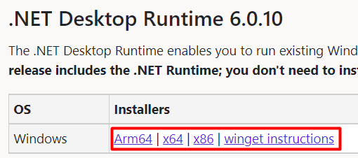
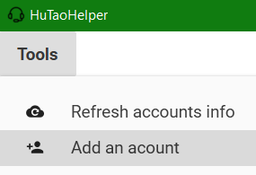
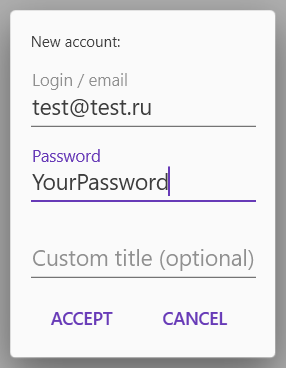
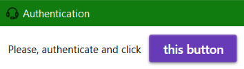
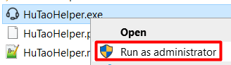
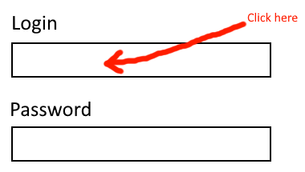
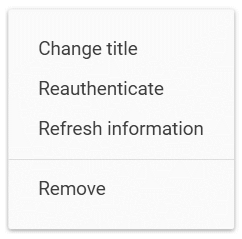

# HuTaoHelper
EN | [RU](README.ru.md)\
Automation tool and account manager for anime game

### What is it?
If you have 2 or more accounts, then you know how it
feels like to switch them everyday to complete
daily commissions, to claim daily check-in reward or
complete some web events

This tool aims to simplify your life as possible

### Requirements
- .net 6.0+ (with desktop runtime)\
You can get it [here](https://dotnet.microsoft.com/en-us/download/dotnet/6.0)\

- Edge browser (I think it's included into your windows)

### Known problems
- Only one regional account supported at the moment 
(you can have more than one account if you played on
different regions. First found account will be used)
- User /profile/account.id/ folder is not deleted 
after account deletion
- My code needs a big naming refactor

### Setup and how to
##### Installation
- Download latest build from [releases tab](https://github.com/Mishin870/HuTaoHelper/releases)
- Unpack it and run `HuTaoHelper.exe`

##### Create an account
1. Go to `Tools -> Add an account`\

2. Fill in all required fields and click `Add`\
(_you can also override account title in the
accounts list, this can be changed later_)\

3. The app will then require you to authenticate
to "one well-known site". Log in to your account
and then click on the button above\

4. Wait for 2-3 seconds and your name and avatar
will appear in the accounts list
> If you skipped the authentication step,
> don't worry!\
> You can continue this any time by clicking
> this button:\
> 

##### Autologin into game
> **!Important notice!**\
> The app must be run as administrator
> otherwise autologin won't work\
> 

1. Start the game and open the login window\
(_both for GeForceNOW and native game versions_)
2. Click on the login field so that the
caret appears there\

3. Via `Alt + tab` go back to the application
and click once on your account
4. Sometimes, due to a bug, the password can
be inserted along with the login,
just repeat steps 2-3

##### Claim daily check-in rewards
1. Click onto this button\
   
2. See the result at the bottom\
   

> P.S. soon I will automate this with
> windows task scheduler

##### Manage accounts
You can edit accounts by right clicking on them\

### F.A.Q.
Q: **What if you use my passwords?**\
A: Your passwords are saved locally and used only
for autologin purposes (both game and website)\
You can inspect all my code and make your own build.
By the way, I'm developing this out of interest,
I don't need your accounts, guys :)

Q: **So my passwords are safe?**\
A: Not really. The application stores them
not encrypted in the `settings.json` file. Maybe
this will be fixed later

Q: **Can I get banned for this?**\
A: I don't know. This program mimics normal
browser requests, I can add a random wait between
requests later just in case\
**!!!Use this tool at your own risk!!!**

Q: **How can I support you?**\
A: Give this repository a star :D\
You can also submit any ideas, bugs or pull
requests\
If you know some language except English,
Russian and Ukrainian, then you can help us
with translation on them\
For every language its required to translate this
README.md file and create its own resx file in the
folder /Localization/Resources\

### Plans and features
Some features are still in development
- [X] Auto login for real game
- [X] Auto login for GeForce Now
- [X] Daily check-in in one click
- [X] Retrieving account information
- [X] Visual way to create a new account
- [X] Ability to remove accounts
- [X] Documentation and how to
- [X] Migration service for settings
- [X] Ability to edit accounts
- [X] Localization to other languages
- [ ] Accounts reordering
- [ ] Update system
- [ ] Automation for web events
- [ ] Minimizing to tray
- [ ] Reward claiming notification (e.g. windows,
telegram, email)
- [ ] Reminder system
- [ ] Background service for check-in
