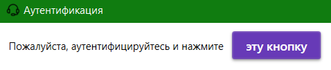
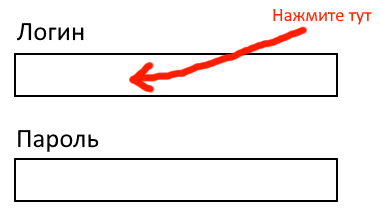

# HuTaoHelper
[[EN](README.md) | RU | [UA](README.ua.md)]

Менеджер аккаунтов и инструмент автоматизации для
одной аниме игры

### Что это?
Если вы когда-то пользовались двумя или более
аккаунтами, то вы наверняка знаете это чувство,
когда вам нужно переключаться между ними каждый день,
чтобы завершать ежедневки, чтобы кликать ежедневную
отметку на сайте или чтобы выполнять различные
веб-ивенты

Это приложение поможет облегчить вашу жизнь
насколько это вообще возможно

### Требования
- .net 6.0+ (обязательно с desktop runtime)\
Можно скачать [тут](https://dotnet.microsoft.com/en-us/download/dotnet/6.0)\

- Браузер Edge (Скорее всего он уже есть у вас)

### Известные проблемы
- Поддерживается только один региональный аккаунт 
(у вас может быть больше одного аккаунта в игре, если
вы играли на различных регионах. Будет использоваться
первый аккаунт по списку)
- Папка профиля пользователя /profile/account.id/
не удаляется после удаления самого аккаунта
- Мой код нуждается в огромной переработке

### Установка и инструкция по использованию
##### Установка
- Скачайте последнюю сборку со [вкладки релизов](https://github.com/Mishin870/HuTaoHelper/releases)
- Распакуйте её и запустите `HuTaoHelper.exe`

##### Создание аккаунта
1. Нажмите `Инструменты -> Добавить аккаунт`\

2. Заполните все требуемые поля и нажмите `Добавить`\
(_вы так же можете переопределить имя в списке
аккаунтов, это можно будет менять в будущем_)\

3. Дальше приложение попросит вас аутентифицироваться
на "одном известном сайте". Войдите в свой аккаунт
и нажмите на кнопку сверху\

4. Подождите 2-3 секунды и ваше имя и аватарка
появятся в списке
> Если вы пропустили этап аутентификации,
> не беспокойтесь!\
> Вы сможете его продолжить в любое время, кликнув
> на эту кнопку:\
> 

##### Автовход в игру
1. Запустите игру и откройте окно входа в аккаунт\
(_одинаково для обычной игры и для GeForceNOW версии_)
2. Нажмите на поле для ввода логина, чтобы на нём
появилась каретка ввода\

3. Нажмите `Alt + tab` и вернитесь обратно в
приложение. Нажмите один раз на нужный аккаунт
в списке
4. Иногда из-за бага пароль может появиться вместе
с логином. Просто повторите шаги 2-3

##### Забрать награду ежедневной отметки
1. Нажмите на эту кнопку\
   
2. Результат нажатия снизу\
   

##### Автоматизация ежедневных отметок
1. Нажмите на этот пункт меню\
   
2. Готово! Каждый день в это же время все аккаунты
будут автоматически отмечаться

> Чтобы увидеть созданную фоновую задачу,
> откройте пуск и напишите: `taskschd.msc`\
> Здесь находится сама задача:\
> 

##### Управление аккаунтами
Вы можете редактировать аккаунты, нажимая правой
кнопкой мыши по ним\

### F.A.Q.
Q: **Вы можете своровать мои пароли?**\
A: Ваши пароли хранятся у вас локально и используются
только в целях автовхода (как для игры, так и для
сайта)\
Вы можете просмотреть весь мой исходный код или
даже собрать свою версию проекта, всё открыто.
К слову, я разрабатываю этот проект на чистом интересе,
мне не нужны ваши пароли, ребят :)

Q: **Значит, мои пароли в полной безопасности?**\
A: К сожалению, нет. Программа хранит пароли в
открытом виде в файле `settings.json`. Может быть
в будущем я это исправлю

Q: **Забанят ли меня за использование этой
программы?**\
A: Я не знаю. Эта программа имитирует обычные
запросы браузера, но я в будущем скорее всего добавлю
случайные задержки между "кликами" на всякий случай\
**!!!Используйте эту программу на свой страх и риск!!!**

Q: **Как я могу помочь вам?**\
A: Поставьте звёздочку этому репозиторию :D\
Так же вы можете писать мне здесь любые идеи,
присылать баги или создавать pull request'ы\
Если вы знаете какой-то язык, кроме Английского,
Русского и Украинского, то вы можете помочь нам
с переводом на него\
Для каждого языка требуется перевод этой заметки
(README.md) и свой файл resx в папке
/Localization/Resources

### Планы и фичи
Некоторые механики ещё в разработке
- [X] Автовход в реальную игру
- [X] Автовход в GeForce NOW версию игры
- [X] Сбор ежедневных отметок в один клик
- [X] Запрос информации об аккаунтах
- [X] Визуальное меню для создания аккаунтов
- [X] Возможность удалять аккаунты
- [X] Документация и инструкции
- [X] Сервис миграции для настроек
- [X] Возможность редактировать аккаунты
- [X] Локализации на другие языки
- [X] Фоновый сервис для сбора ежедневных отметок
- [ ] Изменение порядка аккаунтов
- [ ] Система автоматического обновления
- [ ] Автоматизация веб-ивентов
- [ ] Сворачивание в трей
- [ ] Уведомления о сборе наград (например, через
  уведомления windows, почту, telegram)
- [ ] Система напоминаний
