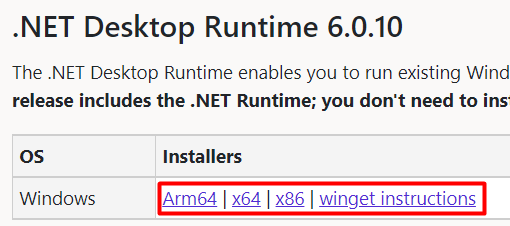
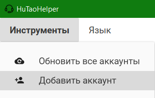
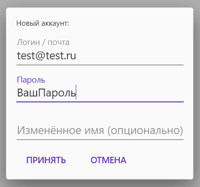

# HuTaoHelper
[[EN](README.md) | RU]

Менеджер акаунтів та інструмент автоматизації для
однієї аніме гри

### Що це?
Якщо ви колись користувалися двома або більше
акаунтами, то ви, напевно, знаєте це почуття,
коли вам потрібно перемикатися між ними кожен день,
щоб виконувати щоденні завдання, щоб кликать щоденну
отметку на сайті або щоб виконувати різноманітні
веб-івенти

Цей застосунок допоможе полегшити ваше життя
наскільки це взагалі можливо

### Вимоги
- .net 6.0+ (обов'язково з desktop runtime)\
Можна завантажити [тут](https://dotnet.microsoft.com/en-us/download/dotnet/6.0)\

- Браузер Edge (найімовірніше він у вас вже є)

### Відомі проблеми
- Підтримується тільки один регіональний акаунт 
(у вас може бути більш ніж один акаунт, якщо
ви грали на різних регіонах. Буде використовуватися
перший акаунт за списком)
- Папка профілю користувача /profile/account.id/
не видаляється після видалення самого акаунта
- Мій код потребує величезного перероблення

### Встановлення та інструкція з використання
##### Встановлення
- Завантажте останню збірку з [вкладки релізів](https://github.com/Mishin870/HuTaoHelper/releases)
- Розпакуйте її та запустіть `HuTaoHelper.exe`

##### Створення акаунта
1. Натисніть `Інструменти -> Додати акаунт`\

2. Заповніть усі необхідні поля та натисніть `Додати`\
(_також ви можете перевизначити ім'я у списку
акаунтів, його можна буде міняти у майбутньому_)\

3. Далі застосунок попросить вас аутентифікуватися
на "одному відомому сайті". Увійдіть до свого акаунта
та натисніть на кнопку зверху\

4. Після 2-3 секунд очікування ваше ім'я та аватарка
з'являться у списку
> Якщо ви пропустили етап аутентифікації,
> не хвилюйтесь!\
> Ви зможете його продовжити в будь-який час, натиснувши
> на цю кнопку:\
> 
##### Автовхід до гри
> **!Важлива інформація!**\
> Для роботи автологіна потрібно, щоб програма
> була запущена від имені адміністратора, інакше
> він не працюватиме\
> 
1. Запустіть гру та відкрийте вікно входу в акаунт\
(_однаково для звичайної гри та для GeForceNOW версії_)
2. Натисніть на поле для вводу логіна, щоб на ньому
з'явилась каретка введення\

3. Натисніть `Alt + tab` та поверніться до
додатку. Натисніть один раз на потрібний акаунт
в списку
4. Иноді черз баг пароль може з'явитися разом
з логіном. Просто повторіть кроки 2-3

##### Забрати нагороду ежедневной отметки
1. Натисніть на цю кнопку\
   
2. Результат натискання знизу\
   

> P.S. в майбутньому я автоматизую це повністю
> за допомогою планувальника задач Windows
##### Управління акаунтами
Ви можете редагувати акаунти, натиская по них
правою кнопкою миші\

### F.A.Q.
Q: **Ви можете вкрасти мої паролі?**\
A: Ваші паролі зберігаються у вас локально та використовуються
лише в цілях автологіна (як для гри, так і для
сайту)\
Ви можете переглянути увесь мій вихідний код чи
навіть зібрати власну версію проєкта, все прозоро.
До речі, я розроблюю цей проєкт виключно з власного інтересу,
мені не потрібні ваші паролі :)

Q: **Значить мої паролі в повній безпеці?**\
A: На жаль, ні. Програма зберігає паролі у
відкритому вигляді в файлі `settings.json`. Можливо
в майбутньому я це виправлю

Q: **Чи забанять мене за використання цієї
програми?**\
A: Я не знаю. Ця програма імітує звичайні
запити браузера, але у майбутньому я скоріш за все додам
випадкові паузи між "кліками" про всяк випадок\
**!!!Використовуйте цю програму на свій страх і різик!!!**

Q: **Як я можу вам допомогти?**\
A: Поставте зірочку цьому репозиторію :D\
Також ви можете писати меня тут будь-які ідеї,
надсилати баги або створювати pull request'и\
Якщо ви знаєте якусь мову, окрім Англійскої,
Російської або Української, то ви можете допомогти нам
з перекладом на неї\
Для кожної мови потрібен переклад цієї замітки
(README.md) та свій файл resx в папці
/Localization/Resources

### Плани та функції
Деякі механіки ще в розробці
- [X] Автовхід до реальної гри
- [X] Автовхід до GeForce NOW версії гри
- [X] Збір щоденних отметок в один клік
- [X] Запит інформації про акаунти
- [X] Візуальне меню для створення акаунтів
- [X] Можливість видаляти акаунти
- [X] Документація та інструкції
- [X] Сервіс міграції для налаштувань
- [X] Можливість редагувати акаунти
- [X] Локалізація на інші мови
- [ ] Зміна порядку акаунтів
- [ ] Система автоматичного оновления
- [ ] Автоматизація веб-івентів
- [ ] Згортання в трей
- [ ] Повідомлення про збирання нагород (наприклад, через
повідомлення Windows, пошту, Telegram)
- [ ] Система нагадувань
- [ ] Фоновий серві для збору щоденних отметок
